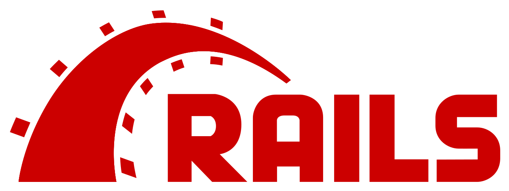

<div align="center">
  
  <br>
</div>

<a name="readme-top"></a>

# 📗 Table of Contents

- [📖 About the Project](#about-project)
  - [🛠 Built With](#built-with)
    - [Tech Stack](#tech-stack)
    - [Key Features](#key-features)
  - [🔭 Project Presentation](#project-presentation)
  - [🚀 Live Demo](#live-demo)
- [💻 Getting Started](#getting-started)
  - [Setup](#setup)
  - [Prerequisites](#prerequisites)
  - [Install](#install)
  - [Usage](#usage)
  - [Run tests](#run-tests)
- [👥 Authors](#authors)
- [🔭 Future Features](#future-features)
- [🤝 Contributing](#contributing)
- [⭐️ Show your support](#support)
- [🙏 Acknowledgements](#acknowledgements)
- [📝 License](#license)

# 📖 Hello World <a name="about-project"></a>

> This is a Ruby on Rails back-end designed to efficiently store, manage, and serve a collection of dynamic random messages.

## 🛠 Built With <a name="built-with"></a>

### Tech Stack <a name="tech-stack"></a>

Server: <a href="https://rubyonrails.org/">Ruby on Rails</a></li>
Database: <a href="https://www.postgresql.org/">PostgreSQL</a></li>

<!-- Features -->

### Key Features <a name="key-features"></a>

**Dynamic Randomness:** Generate excitement by serving users with dynamically generated random messages.

**Robust API:** Built on the reliable Ruby on Rails framework, the API offers robustness, scalability, and security.

**Easy Integration:** Seamlessly integrate the API into your applications using standardized API endpoints.

<p align="right">(<a href="#readme-top">back to top</a>)</p>

### Frontend Part of the Project

[Hello React Frontend](https://github.com/DJ-MrJay/hello-react-front-end)

<p align="right">(<a href="#readme-top">back to top</a>)</p>

### Live Demo <a name="live-demo"></a>

Not available.

<p align="right">(<a href="#readme-top">back to top</a>)</p>

## 💻 Getting Started <a name="getting-started"></a>

To get a local copy up and running, follow these steps.

### Prerequisites

In order to run this project you need the following installed on your computer:
Ruby v3+,
Rails v7+
PostgreSQL
An IDE e.g. [Visual Studio Code](https://code.visualstudio.com/)
A terminal e.g. [Git BASH](https://gitforwindows.org/)

### Setup

Clone this repository or download the Zip folder:

```
git clone https://github.com/DJ-MrJay/hello-rails-back-end
```

- Navigate to the location of the folder you just cloned:

```
cd hello-rails-back-end
```

### Install

Install all dependencies:

```
bundle install
```
### Database Setup

Navigate to `config/database.yml` and edit the username and password with your PostgreSQL credentials (line 21 and 22)

Run the following command:
```
rails db:create db:migrate db:seed
```

### Usage

To run the App type the following command in your terminal:

```
rails server
```

### Run tests

To check for and autofix linter errors, type the following command:

```
rubocop -A
```

<p align="right">(<a href="#readme-top">back to top</a>)</p>

## 👤 Author <a name="authors"></a>

👤 **Jonah Wambua**

GitHub [link](https://github.com/DJ-MrJay)
Twitter [link](https://twitter.com/jonah_wambua)
LinkedIn [link](https://www.linkedin.com/in/jonah-wambua/)


<p align="right">(<a href="#readme-top">back to top</a>)</p>

## 🔭 Future Features <a name="future-features"></a>

User Authentication and Authorization
Language Localization

<p align="right">(<a href="#readme-top">back to top</a>)</p>

## 🤝 Contributing <a name="contributing"></a>

Contributions, issues, and feature requests are welcome. If you find bugs, have suggestions for improvements, or want to add new features, please feel free to add an issue on the [issues page](../../issues/).

<p align="right">(<a href="#readme-top">back to top</a>)</p>

## ⭐️ Show your support <a name="support"></a>

Give a ⭐️ if you like this project.

<p align="right">(<a href="#readme-top">back to top</a>)</p>

## 🙏 Acknowledgments <a name="acknowledgements"></a>

[Microverse](https://www.microverse.org) for a A+ curriculum
Code reviewers, coding partners, morning and standup teams for the great insights
Hat tip to anyone else whose code was used

<p align="right">(<a href="#readme-top">back to top</a>)</p>

## 📝 License <a name="license"></a>

This project is [MIT](./LICENSE) licensed.

<p align="right">(<a href="#readme-top">back to top</a>)</p>
